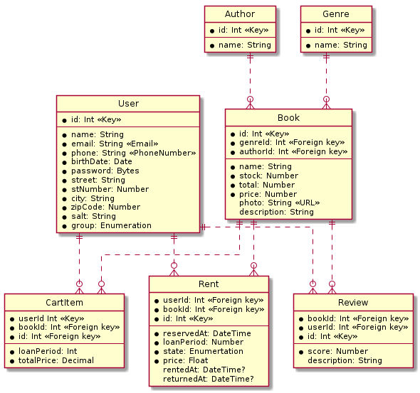

# Projekt PV179
## 2.  Systém na rezerváciu kníh

### Autori
- Radomír Mann
- Kristián Gutič
- Richard Lacek

### Nasadenie
- systém je nasadený na Microsoft Azure
- url: https://bookreservation.azurewebsites.net

### Systém bude umožňovať:  

- autentizáciu užívateľov  
- užívateľovi si zmeniť osobné údaje  
- užívateľovi pridávať knihy určené na zapožičanie/rezerváciu  
- užívateľovi vytvoriť rezerváciu na knihu, ktorú by si chcel prečítať  
- užívateľovi pridávať hodnotenia na knihy  
- užívateľovi zobraziť históriu rezervácií  
- adminovi pridávať/mazať/upravovať knihy, užívateľov, …  
- zobraziť ponuku kníh  
- vyhľadávanie na základe pár parametrov (napr. žáner, autor, hodnotenie, dostupnosť, …)

### Diagram tried

